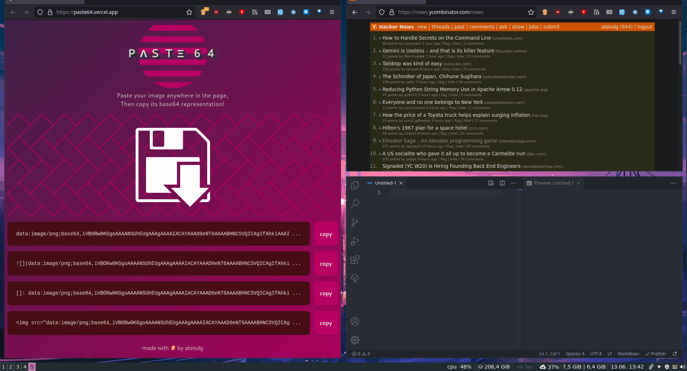

*Looking for a shareable component template? Go here --> [sveltejs/component-template](https://github.com/sveltejs/component-template)*

---

# Paste64

Paste64 is a tool I have built to scratch an itch. I wanted to be able to paste any image from my clipboard (mostly screenshot in my case) to get its base64 version so I can integrate it directly in any markdown. So Paste64 was born. [Try it online!](https://paste64.vercel.app/)

It was also an excuse to try out Svelte.

## Demo

## Stack

-  Svelte
-  Rollup.js
-  
TypeScript 
-  Tailwindcss

## Contributing

Help and feedback is always welcome and pull requests get accepted.

## License

[MIT](./LICENSE)
